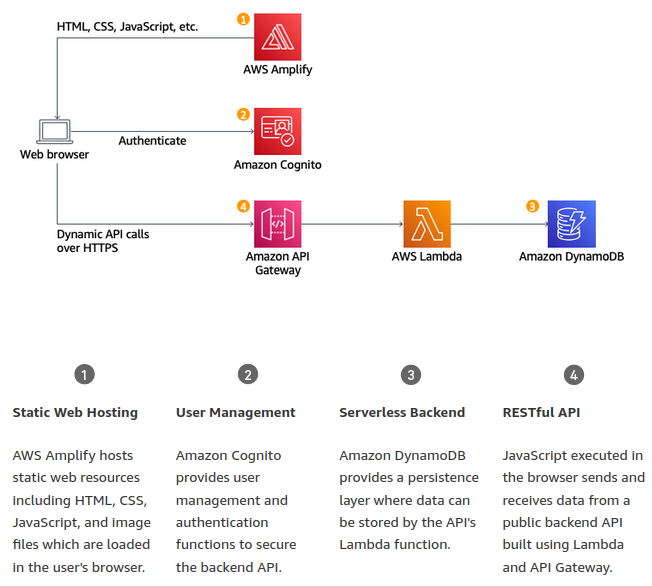

# Serverless web application

Refer to [Build a Serverless Web Application with AWS Lambda, Amazon API Gateway, AWS Amplify, Amazon DynamoDB, and Amazon Cognito](https://aws.amazon.com/getting-started/hands-on/build-serverless-web-app-lambda-apigateway-s3-dynamodb-cognito/?nc1=h_ls)

## Static web Hosting with Continuous deployment

All of your static web content will be managed by *AWS Amplify Console*. Your end users will then access your site using the <u>public website URL exposed by AWS Amplify</u> Console, no web server or other services are required.

1. **Select a Region**, will be used for all the services used in this application

2. **Create a Git repository**, in *AWS CodeCommit console*
   
   * set the repo name
   
   * set up an <u>*IAM user* with GIt credentials</u>
   
   * select clone HTTPS

3. **Populate the Git repository**, copy the website content from an existing publicly accessible *S3 Bucket*
   
   * change directory into your repo and copy the static files from S3
     
     `cd <web-site-name>`
     
     `aws s3 cp s3://<aws-name>-<region>/WebApplication/1_StaticWebHosting/ website ./ --recursive`
   
   * commit the files to your Git service

4. **Enable web hosting with AWS Amplify Console**
   
   * create a *New App* and choose *Host web app*
   
   * select the repository service provide and commit code

5. **Setup AWS Amplify to automatically deploy all files hosted**

---

